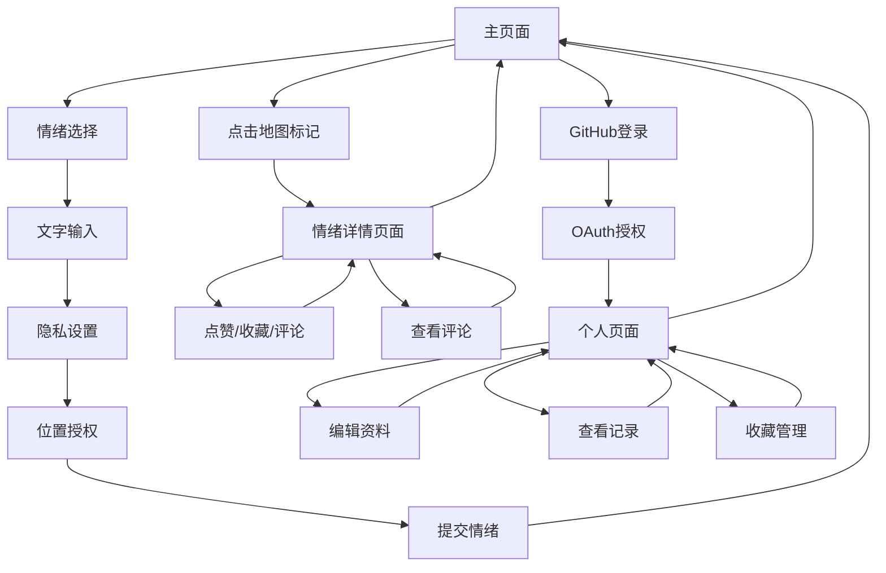

# 实时情绪分享与可视化平台What's Weather - 产品需求文档

## 1. 产品概述

What's Weather打造实时情绪分享与可视化平台，让用户在地图上分享、查看全球各地情绪状态，核心是将抽象情绪转化为类似"天气"的直观图标，通过地图呈现，传递"情绪如天气般可感知、可共享"的理念。

注重轻量、快速、匿名的用户体验，支持完全匿名化的情绪分享，通过GitHub OAuth提供可选的个人账户功能。

目标是创建一个全球性的情绪共享社区，让用户能够感知世界各地的情感状态，促进情感共鸣和理解。

## 2. 核心功能

### 2.1 用户角色

| 角色   | 注册方式           | 核心权限                  |
| ---- | -------------- | --------------------- |
| 匿名用户 | 无需注册           | 可查看地图情绪、提交匿名情绪（需位置权限） |
| 注册用户 | GitHub OAuth登录 | 拥有个人页面、可编辑个人资料和历史情绪记录 |

### 2.2 功能模块

我们的情绪分享平台包含以下主要页面：

1. **主页面**：情绪选择器、地图可视化区域、登录入口、社交互动功能
2. **个人页面**：个人资料展示、情绪打卡记录、内容编辑功能、收藏管理
3. **OAuth回调页面**：GitHub登录授权处理
4. **情绪详情页面**：情绪内容展示、评论区域、社交互动按钮

### 2.3 页面详情

| 页面名称      | 模块名称   | 功能描述                                                        |
| --------- | ------ | ----------------------------------------------------------- |
| 主页面       | 情绪选择器  | 提供5种固定情绪选择（开心☀️、焦虑⚡、平静🌈、悲伤🌧️、愤怒🔥）和自定义情绪功能，支持100+种emoji选择 |
| 主页面       | 文字输入区  | 支持200字以内匿名短文字输入，实时字数统计，XSS过滤                                |
| 主页面       | 隐私设置   | 发布时可选择是否公开内容、是否允许收藏，默认公开且允许收藏                             |
| 主页面       | 位置获取   | 使用Geolocation API获取高精度经纬度，未授权时显示权限提示弹窗                      |
| 主页面       | 地图可视化  | 集成Leaflet地图引擎，实时显示全球情绪标记，支持缩放、平移、定位功能                       |
| 主页面       | 情绪标记交互 | 点击地图标记显示情绪详情，支持点赞、评论、收藏操作，非公开内容显示权限提示                       |
| 主页面       | 登录入口   | 右上角GitHub OAuth登录按钮，登录后显示个人页面入口                             |
| 个人页面      | 个人资料   | 显示GitHub昵称、可编辑个人简介                                          |
| 个人页面      | 情绪记录   | 按时间倒序显示个人情绪打卡记录（情绪图标、时间、位置、文字内容、互动数据）                        |
| 个人页面      | 收藏管理   | 显示用户收藏的情绪帖子列表，支持取消收藏和快速访问                                 |
| 个人页面      | 内容编辑   | 支持编辑个人简介、已发布情绪的匿名文字内容和隐私设置                                |
| 情绪详情页面    | 内容展示   | 显示情绪详细信息（图标、文字、时间、位置），非公开内容显示"用户已关闭权限"提示                  |
| 情绪详情页面    | 社交互动   | 点赞按钮（显示点赞数）、收藏按钮（需权限）、分享按钮                                |
| 情绪详情页面    | 评论系统   | 评论列表、发表评论输入框、评论点赞功能，支持嵌套回复                                |
| OAuth回调页面 | 授权处理   | 处理GitHub OAuth回调，自动创建用户账户，跳转回主页面                            |

## 3. 核心流程

### 匿名用户流程

用户访问主页面 → 选择情绪类型 → 输入匿名文字（可选） → 设置隐私选项 → 授权位置获取 → 提交情绪 → 在地图上查看全球情绪分布 → 点击标记查看情感故事（可浏览但无法互动）

### 注册用户流程

用户点击GitHub登录 → OAuth授权 → 自动创建账户 → 返回主页面 → 访问个人页面 → 查看/编辑个人资料和情绪记录 → 管理收藏内容

### 社交互动流程

注册用户点击地图标记 → 进入情绪详情页面 → 查看完整内容（如有权限） → 点赞/收藏/评论 → 查看其他用户评论 → 回复评论

## 4. 用户界面设计

### 4.1 设计风格

* **主色调**：天空蓝 (#87CEEB) 和温暖橙 (#FFA500)

* **辅助色**：浅灰 (#F5F5F5) 和深灰 (#333333)

* **按钮样式**：圆角矩形，3D阴影效果，悬停时颜色加深

* **字体**：主标题使用 'Helvetica Neue', 正文使用 'Arial', 中文优先显示 'Microsoft YaHei'

* **字体大小**：标题 24px，正文 16px，小字 14px

* **布局风格**：卡片式设计，顶部导航栏，主要内容区域采用Flex布局

* **图标风格**：使用emoji表情和简洁的SVG图标，情绪图标采用天气主题

### 4.2 页面设计概览

| 页面名称 | 模块名称   | UI元素                                              |
| ---- | ------ | ------------------------------------------------- |
| 主页面  | 顶部导航   | 白色背景，右上角GitHub登录按钮（蓝色圆角），登录后显示用户头像和个人页面链接         |
| 主页面  | 情绪选择器  | 居中卡片布局，5个情绪按钮水平排列，选中状态有蓝色边框，自定义按钮打开emoji选择器       |
| 主页面  | 文字输入区  | 白色圆角文本框，placeholder提示"分享你的情感故事（200字以内）"，右下角实时字数统计 |
| 主页面  | 隐私控制   | 两个切换开关："公开内容"和"允许收藏"，默认开启，橙色激活状态                |
| 主页面  | 地图区域   | 占据页面70%高度，Leaflet地图，情绪标记使用对应emoji图标，点击跳转详情页面      |
| 个人页面 | 个人信息卡  | 左侧GitHub头像，右侧昵称和可编辑简介，编辑按钮为铅笔图标                   |
| 个人页面 | 情绪记录列表 | 卡片式布局，显示情绪图标、时间、位置、文字内容、互动数据（点赞数、评论数、收藏数）        |
| 个人页面 | 收藏列表   | 网格布局，显示收藏的情绪卡片，支持快速访问和取消收藏                        |
| 情绪详情页面 | 内容区域   | 大卡片布局，顶部情绪图标和文字，底部时间位置信息，非公开内容显示锁定图标和提示文字       |
| 情绪详情页面 | 互动按钮   | 底部固定栏，点赞按钮（红心图标+数字）、收藏按钮（星星图标）、分享按钮（箭头图标）      |
| 情绪详情页面 | 评论区域   | 评论列表，每条评论显示用户头像、昵称、内容、时间，支持点赞和回复                  |

### 4.3 响应式设计

产品采用移动端优先的响应式设计，在桌面端、平板和手机上均能良好显示。

* **桌面端（>1024px）**：地图和情绪选择器并排显示，充分利用屏幕空间

* **平板端（768px-1024px）**：地图和选择器垂直排列，保持良好的触控体验

* **移动端（<768px）**：单列布局，地图高度适配，情绪按钮增大便于触控

* **触控优化**：所有按钮最小44px点击区域，支持手势缩放地图

