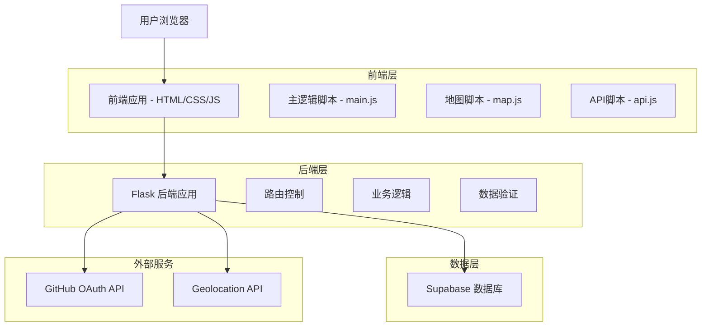
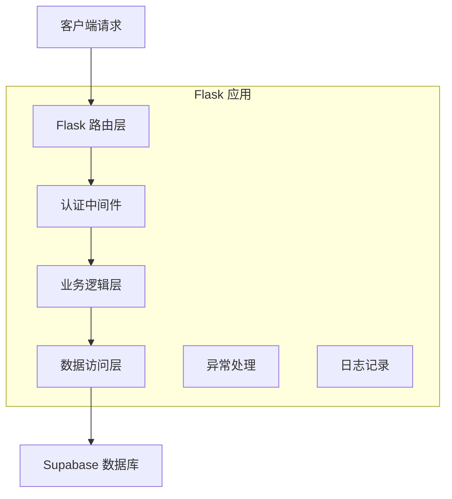
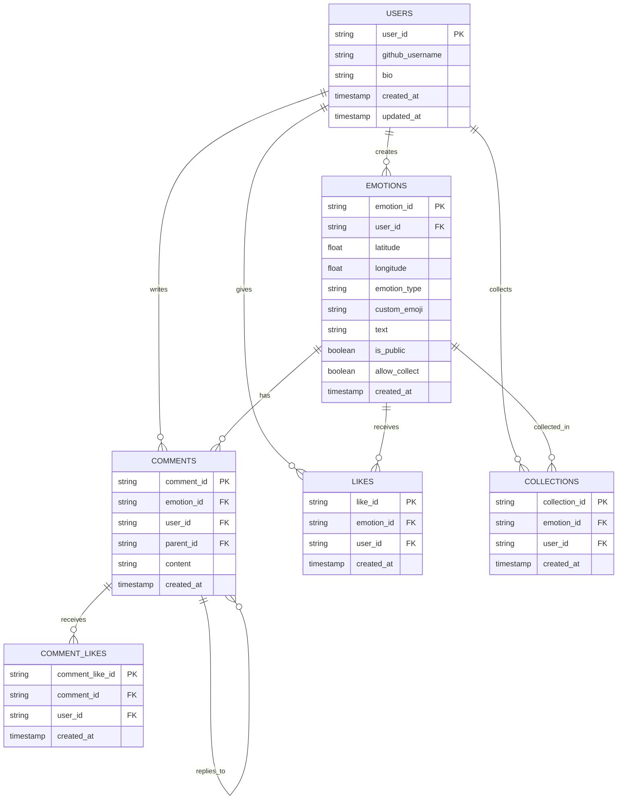

# 实时情绪分享与可视化平台 - 技术架构文档

## 1. 架构设计



## 2. 技术描述

* **前端**: HTML5 + CSS3 + 原生JavaScript(ES6+) + Leaflet地图库

* **后端**: Python 3.8+ + Flask 2.3.3 + Flask-CORS

* **数据库**: Supabase (PostgreSQL)

* **认证**: GitHub OAuth 2.0

* **地图服务**: Leaflet + OpenStreetMap

## 3. 路由定义

| 路由             | 用途               |
| -------------- | ---------------- |
| /              | 主页面，显示地图和情绪选择器   |
| /profile       | 个人页面，显示用户资料和情绪记录 |
| /auth/github   | GitHub OAuth登录跳转 |
| /auth/callback | GitHub OAuth回调处理 |
| /logout        | 用户登出             |

## 4. API定义

### 4.1 核心API

**获取全球情绪数据**

```
GET /api/emotions
```

响应:

| 参数名           | 参数类型   | 描述     |
| ------------- | ------ | ------ |
| emotions      | array  | 情绪数据列表 |
| id            | string | 情绪ID   |
| latitude      | float  | 纬度     |
| longitude     | float  | 经度     |
| emotion\_type | string | 情绪类型   |
| text          | string | 匿名文字   |
| created\_at   | string | 提交时间   |

示例:

```json
{
  "emotions": [
    {
      "id": "uuid-1234",
      "latitude": 39.9042,
      "longitude": 116.4074,
      "emotion_type": "happy",
      "text": "今天天气真好！",
      "created_at": "2024-01-15T10:30:00Z"
    }
  ]
}
```

**提交情绪数据**

```
POST /api/emotions
```

请求:

| 参数名           | 参数类型   | 是否必需  | 描述           |
| ------------- | ------ | ----- | ------------ |
| user\_id      | string | false | 用户匿名标识       |
| latitude      | float  | true  | 纬度           |
| longitude     | float  | true  | 经度           |
| emotion\_type | string | true  | 情绪类型         |
| text          | string | false | 匿名文字(最多200字) |

响应:

| 参数名         | 参数类型    | 描述       |
| ----------- | ------- | -------- |
| success     | boolean | 提交状态     |
| message     | string  | 响应消息     |
| emotion\_id | string  | 新创建的情绪ID |

**获取个人情绪记录**

```
GET /api/user/emotions
```

请求头:

| 参数名           | 参数类型   | 是否必需 | 描述           |
| ------------- | ------ | ---- | ------------ |
| Authorization | string | true | Bearer token |

响应:

| 参数名      | 参数类型  | 描述       |
| -------- | ----- | -------- |
| emotions | array | 用户情绪记录列表 |

**编辑个人资料**

```
PUT /api/user/profile
```

请求:

| 参数名 | 参数类型   | 是否必需  | 描述   |
| --- | ------ | ----- | ---- |
| bio | string | false | 个人简介 |

**编辑情绪内容**

```
PUT /api/emotions/{emotion_id}
```

请求:

| 参数名           | 参数类型    | 是否必需  | 描述       |
| ------------- | ------- | ----- | -------- |
| text          | string  | false | 新的匿名文字内容 |
| is_public     | boolean | false | 是否公开     |
| allow_collect | boolean | false | 是否允许收藏   |

**社交互动API**

点赞情绪
```
POST /api/emotions/{emotion_id}/like
```

取消点赞
```
DELETE /api/emotions/{emotion_id}/like
```

收藏情绪
```
POST /api/emotions/{emotion_id}/collect
```

取消收藏
```
DELETE /api/emotions/{emotion_id}/collect
```

获取用户收藏列表
```
GET /api/user/collections
```

**评论系统API**

获取情绪评论
```
GET /api/emotions/{emotion_id}/comments
```

发表评论
```
POST /api/emotions/{emotion_id}/comments
```

请求:
| 参数名        | 参数类型   | 是否必需  | 描述     |
| ---------- | ------ | ----- | ------ |
| content    | string | true  | 评论内容   |
| parent_id  | string | false | 父评论ID  |

点赞评论
```
POST /api/comments/{comment_id}/like
```

## 5. 服务器架构图



## 6. 数据模型

### 6.1 数据模型定义



### 6.2 数据定义语言

**用户表 (users)**

```sql
-- 创建用户表
CREATE TABLE users (
    user_id UUID PRIMARY KEY DEFAULT gen_random_uuid(),
    github_username VARCHAR(255) UNIQUE NOT NULL,
    bio TEXT DEFAULT '',
    created_at TIMESTAMP WITH TIME ZONE DEFAULT NOW(),
    updated_at TIMESTAMP WITH TIME ZONE DEFAULT NOW()
);

-- 创建索引
CREATE INDEX idx_users_github_username ON users(github_username);
CREATE INDEX idx_users_created_at ON users(created_at DESC);

-- 设置权限
GRANT SELECT ON users TO anon;
GRANT ALL PRIVILEGES ON users TO authenticated;
```

**情绪表 (emotions)**

```sql
-- 创建情绪表
CREATE TABLE emotions (
    emotion_id UUID PRIMARY KEY DEFAULT gen_random_uuid(),
    user_id UUID REFERENCES users(user_id) ON DELETE SET NULL,
    latitude DECIMAL(10, 8) NOT NULL,
    longitude DECIMAL(11, 8) NOT NULL,
    emotion_type VARCHAR(50) NOT NULL CHECK (emotion_type IN ('happy', 'anxious', 'calm', 'sad', 'angry', 'custom')),
    custom_emoji VARCHAR(10),
    text TEXT CHECK (LENGTH(text) <= 200),
    is_public BOOLEAN DEFAULT true,
    allow_collect BOOLEAN DEFAULT true,
    created_at TIMESTAMP WITH TIME ZONE DEFAULT NOW()
);

-- 创建索引
CREATE INDEX idx_emotions_user_id ON emotions(user_id);
CREATE INDEX idx_emotions_created_at ON emotions(created_at DESC);
CREATE INDEX idx_emotions_location ON emotions(latitude, longitude);
CREATE INDEX idx_emotions_type ON emotions(emotion_type);
CREATE INDEX idx_emotions_public ON emotions(is_public) WHERE is_public = true;

-- 设置权限
GRANT SELECT ON emotions TO anon;
GRANT ALL PRIVILEGES ON emotions TO authenticated;
```

**评论表 (comments)**

```sql
-- 创建评论表
CREATE TABLE comments (
    comment_id UUID PRIMARY KEY DEFAULT gen_random_uuid(),
    emotion_id UUID NOT NULL REFERENCES emotions(emotion_id) ON DELETE CASCADE,
    user_id UUID NOT NULL REFERENCES users(user_id) ON DELETE CASCADE,
    parent_id UUID REFERENCES comments(comment_id) ON DELETE CASCADE,
    content TEXT NOT NULL CHECK (LENGTH(content) <= 500),
    created_at TIMESTAMP WITH TIME ZONE DEFAULT NOW()
);

-- 创建索引
CREATE INDEX idx_comments_emotion_id ON comments(emotion_id);
CREATE INDEX idx_comments_user_id ON comments(user_id);
CREATE INDEX idx_comments_parent_id ON comments(parent_id);
CREATE INDEX idx_comments_created_at ON comments(created_at DESC);

-- 设置权限
GRANT SELECT ON comments TO anon;
GRANT ALL PRIVILEGES ON comments TO authenticated;
```

**点赞表 (likes)**

```sql
-- 创建点赞表
CREATE TABLE likes (
    like_id UUID PRIMARY KEY DEFAULT gen_random_uuid(),
    emotion_id UUID NOT NULL REFERENCES emotions(emotion_id) ON DELETE CASCADE,
    user_id UUID NOT NULL REFERENCES users(user_id) ON DELETE CASCADE,
    created_at TIMESTAMP WITH TIME ZONE DEFAULT NOW(),
    UNIQUE(emotion_id, user_id)
);

-- 创建索引
CREATE INDEX idx_likes_emotion_id ON likes(emotion_id);
CREATE INDEX idx_likes_user_id ON likes(user_id);

-- 设置权限
GRANT SELECT ON likes TO anon;
GRANT ALL PRIVILEGES ON likes TO authenticated;
```

**收藏表 (collections)**

```sql
-- 创建收藏表
CREATE TABLE collections (
    collection_id UUID PRIMARY KEY DEFAULT gen_random_uuid(),
    emotion_id UUID NOT NULL REFERENCES emotions(emotion_id) ON DELETE CASCADE,
    user_id UUID NOT NULL REFERENCES users(user_id) ON DELETE CASCADE,
    created_at TIMESTAMP WITH TIME ZONE DEFAULT NOW(),
    UNIQUE(emotion_id, user_id)
);

-- 创建索引
CREATE INDEX idx_collections_emotion_id ON collections(emotion_id);
CREATE INDEX idx_collections_user_id ON collections(user_id);
CREATE INDEX idx_collections_created_at ON collections(created_at DESC);

-- 设置权限
GRANT SELECT ON collections TO anon;
GRANT ALL PRIVILEGES ON collections TO authenticated;
```

**评论点赞表 (comment_likes)**

```sql
-- 创建评论点赞表
CREATE TABLE comment_likes (
    comment_like_id UUID PRIMARY KEY DEFAULT gen_random_uuid(),
    comment_id UUID NOT NULL REFERENCES comments(comment_id) ON DELETE CASCADE,
    user_id UUID NOT NULL REFERENCES users(user_id) ON DELETE CASCADE,
    created_at TIMESTAMP WITH TIME ZONE DEFAULT NOW(),
    UNIQUE(comment_id, user_id)
);

-- 创建索引
CREATE INDEX idx_comment_likes_comment_id ON comment_likes(comment_id);
CREATE INDEX idx_comment_likes_user_id ON comment_likes(user_id);

-- 设置权限
GRANT SELECT ON comment_likes TO anon;
GRANT ALL PRIVILEGES ON comment_likes TO authenticated;
```

**初始化数据**

```sql
-- 插入示例情绪数据
INSERT INTO emotions (user_id, latitude, longitude, emotion_type, text) VALUES
(NULL, 39.9042, 116.4074, 'happy', '北京的天气真不错！'),
(NULL, 31.2304, 121.4737, 'calm', '上海的夜景很美'),
(NULL, 22.3193, 114.1694, 'anxious', '工作压力有点大'),
(NULL, 39.0458, 117.7759, 'sad', '想家了'),
(NULL, 30.5728, 104.0668, 'angry', '交通太堵了！');
```

**数据库迁移脚本支持**

```sql
-- 版本控制表
CREATE TABLE schema_migrations (
    version VARCHAR(255) PRIMARY KEY,
    applied_at TIMESTAMP WITH TIME ZONE DEFAULT NOW()
);

-- 示例：添加新字段的迁移
-- ALTER TABLE emotions ADD COLUMN mood_intensity INTEGER DEFAULT 5 CHECK (mood_intensity >= 1 AND mood_intensity <= 10);
-- INSERT INTO schema_migrations (version) VALUES ('20240115_add_mood_intensity');
```

